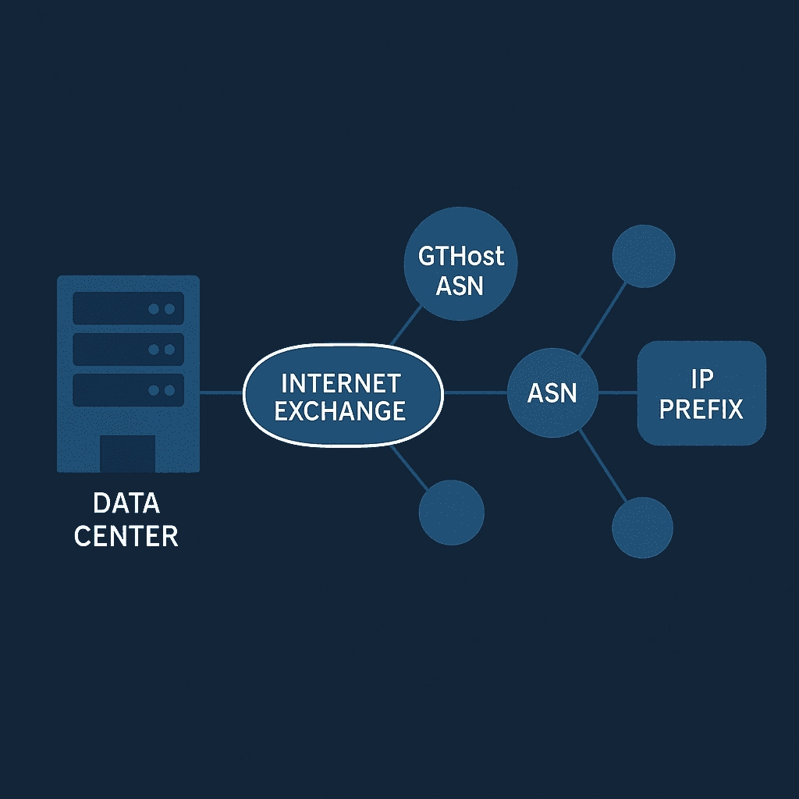

# 用自己的IP段在GTHost上玩转BGP广播（BYOIP完全指南）

---

如果你手里有自己的IP段，又想找个靠谱的地方把它们广播出去，那GTHost的BGP服务可能正是你需要的。无论是IPv4还是IPv6，无论是用他们的ASN还是自己的ASN，都能搞定。这篇文章会告诉你怎么在GTHost上配置BYOIP（自带IP），需要准备什么材料，以及要花多少钱——说白了，就是让你的IP段在互联网上真正"活"起来。

---

## GTHost支持BGP广播和BYOIP吗？

答案是肯定的。GTHost完全支持BGP广播，你可以带着自己的IP段过来（不管是IPv4还是IPv6）。不过有个前提：这个功能只开放给月付的独立服务器用户，日付套餐和VPS是用不了的。

你可以选择通过GTHost的ASN来广播你的IP，也可以用自己的ASN。但不管哪种方式，都得先搞定两样东西：

- **ROA（路由源授权）**：证明这个IP段确实归你管
- **Route Object（路由对象）**：在IRR数据库里注册的路由信息

这两个是硬性要求，没有的话配置流程根本走不下去。

## 费用和基本要求

在GTHost上广播一个IP段，费用结构很简单：

- **一次性设置费**：50美元/每个子网
- **月度维护费**：20美元/每个子网

👉 [想要更灵活的IP管理方案？GTHost的BGP服务了解一下](https://cp.gthost.com/en/join/72c7e6b2fc118929f9ede2978f008806)

举个例子：如果你要同时广播三个/24的IPv4段，那就是：
- 设置费：50美元 × 3 = 150美元
- 月费：20美元 × 3 = 60美元/月

如果你用的是自己的ASN，GTHost还会要求你提供ASN所有权证明。另外有个限制需要注意：同一个子网可以在同一个数据中心的多台服务器上使用，但**不能跨数据中心**。这个设计其实挺合理的，保证了路由的稳定性，也避免了网络层面的混乱。

## IPv6和多前缀支持

GTHost对IPv6和IPv4一视同仁，都支持通过BGP广播。如果你手里有多个IP段想一起广播，也完全没问题——只要每个段都有对应的ROA和路由对象就行。

不过要注意，每个前缀都会单独计费。如果你觉得管理多个小段太麻烦，或者预算有限，可以考虑先合并成更大的段再广播，这样能省点钱。

## 具体操作流程

整个申请流程其实不复杂：

1. **准备材料**
   - 你的IP段信息（前缀/掩码长度）
   - ASN编号（GTHost的或你自己的）
   - ROA链接
   - Route Object链接
   - 如果用自己的ASN，还需要所有权证明

2. **提交工单**
   访问GTHost的工单系统：[cp.gthost.com/en/tickets](https://cp.gthost.com/en/tickets)，把上面准备的材料都贴进去

3. **等待配置**
   技术团队会审核你的材料，然后进行网络配置。通常几个工作日就能搞定

4. **测试验证**
   配置完成后，可以用looking glass或者traceroute工具确认路由是否正常广播

## 适合哪些场景？

说实话，BYOIP不是人人都需要的功能。但如果你遇到以下情况，那这个服务就很有价值：

- **IP地址持续性**：换服务商但想保留原有IP，避免业务中断
- **品牌信誉**：自己的IP段配合PTR记录，发邮件不容易被标记为垃圾
- **多站点部署**：在不同机房使用同一个IP池，方便统一管理
- **防御策略**：自己的ASN可以快速响应DDoS攻击，灵活调整路由策略

当然，如果你只是跑个小网站或者测试项目，用GTHost默认分配的IP就够了，没必要折腾BYOIP。

---

## 最后说两句

把自己的IP段带到GTHost上广播，本质上就是在他们的网络基础设施上"租用"一条对外的通道。配置过程不算复杂，但前期的ROA和路由对象注册可能需要点时间。如果你的业务确实需要IP地址的独立性和可移植性，这个方案还是挺值得考虑的。

对于需要跨多个服务商部署、又想统一IP管理的企业来说，👉 [GTHost的BGP服务能省不少运维上的麻烦](https://cp.gthost.com/en/join/72c7e6b2fc118929f9ede2978f008806)。毕竟网络这种事，稳定和灵活往往比便宜更重要。
